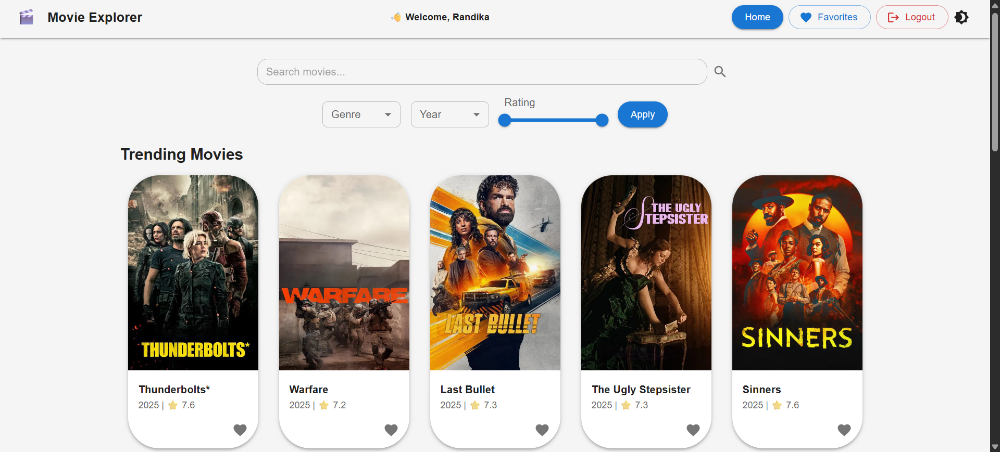
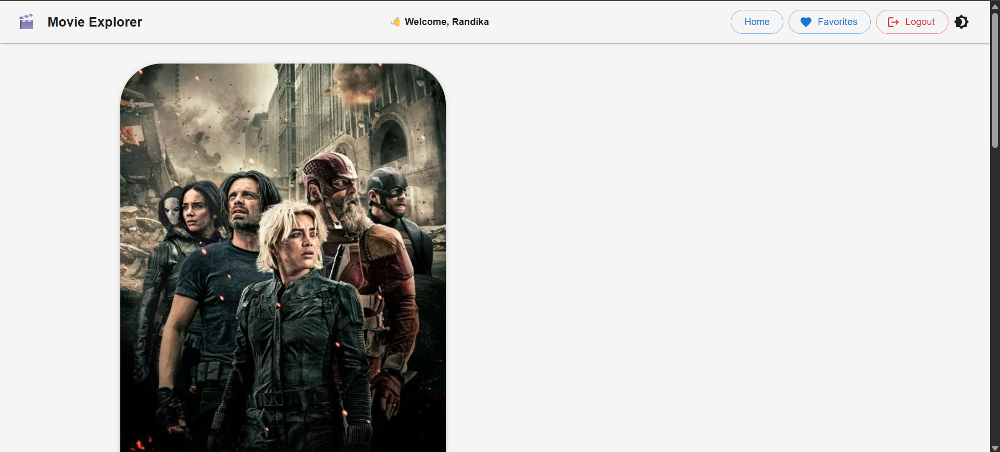
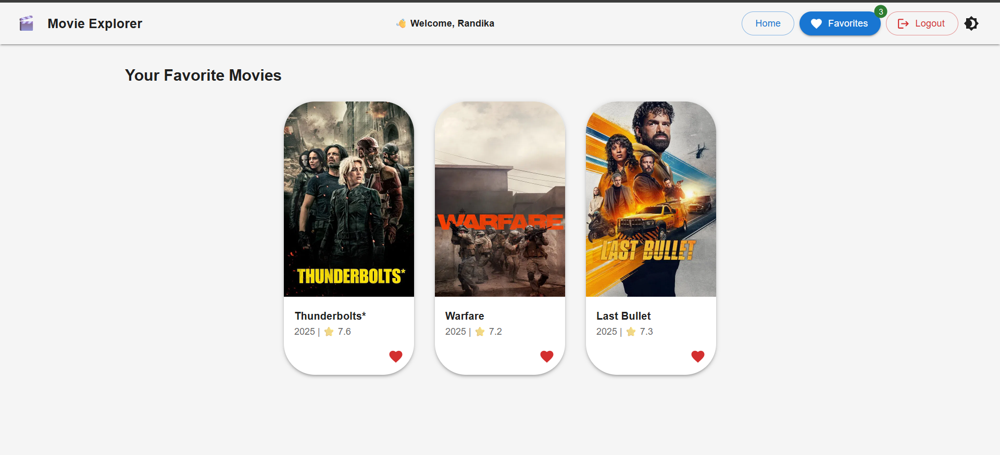

# 🎬 Movie Explorer

A modern and responsive web application to explore trending movies, search titles, view movie details, and manage personal favorites — built with **React**, **Context API**, and **Material-UI**.

## ✨ Features

- 🔍 **Search movies** by title  
- 🎞️ **View details** — Overview, genres, rating, trailer, and top cast  
- ❤️ **Add/remove favorites** (requires login)  
- 🔐 **Simple login system** (session-based)  
- ⚡ **Responsive Navbar** with light/dark theme toggle  
- 🎥 **Embedded YouTube trailers**  
- 📱 **Fully responsive design** (mobile-first)  
- 🔄 **Page transitions** (smooth animations with Framer Motion)  
- 📦 **Data persistence** (favorites + user session using localStorage)

## 📸 Screenshots

| Home Page | Movie Details | Favorites |
|-----------|---------------|-----------|
|  |  |  |

## 🚀 Technologies Used

- **React** (Create React App)
- **Context API** (global state management)
- **Material-UI (MUI)** (modern UI components)
- **Framer Motion** (animations)
- **Axios** (API requests)
- **TMDb API** (movie data)
- **Notistack** (toast notifications)

## 🛠️ Installation (Run locally)

1. **Clone the repo**

```bash
git clone https://github.com/mdhrk2001/movie-explorer.git
cd movie-explorer